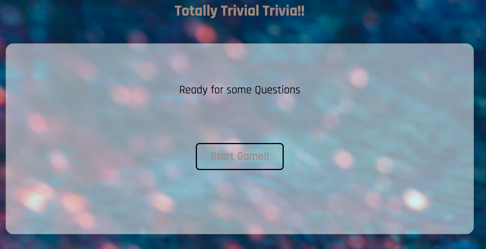
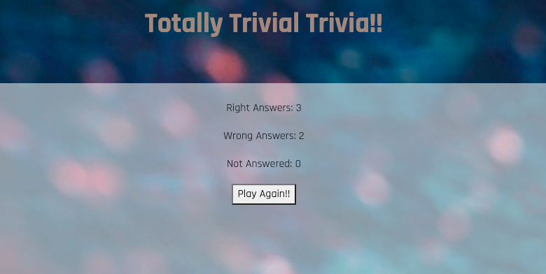

# geocom

Burger Builder is a web app that is created for Burger Restaurants, it allows its users to create/sign-up accounts in which they are able to save their info, after account is created they will be able to place orders, while placing orders they get to customize the sandwich with a responsive burger in which they can see the ingredients with its prices being added or removed on the screen and the price summary.

# Link To Deployed Heroku Site:
https://ziaddessoki.github.io/geocom/

# Instructions
- Click on "Start Game"
- Answer the Trivia questions before the time runs out
- Check out our score
- Play Again

 <strong>Start Game</strong>  
 <strong>Questions</strong>    

 <strong>Score</strong>   

# Technologies Used

- Javascript
- HTML
- CSS

